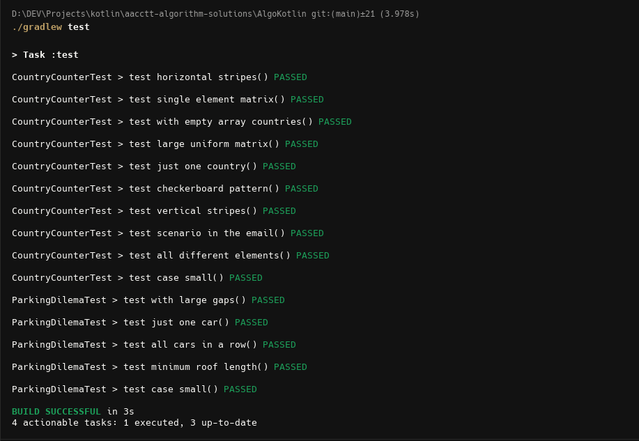
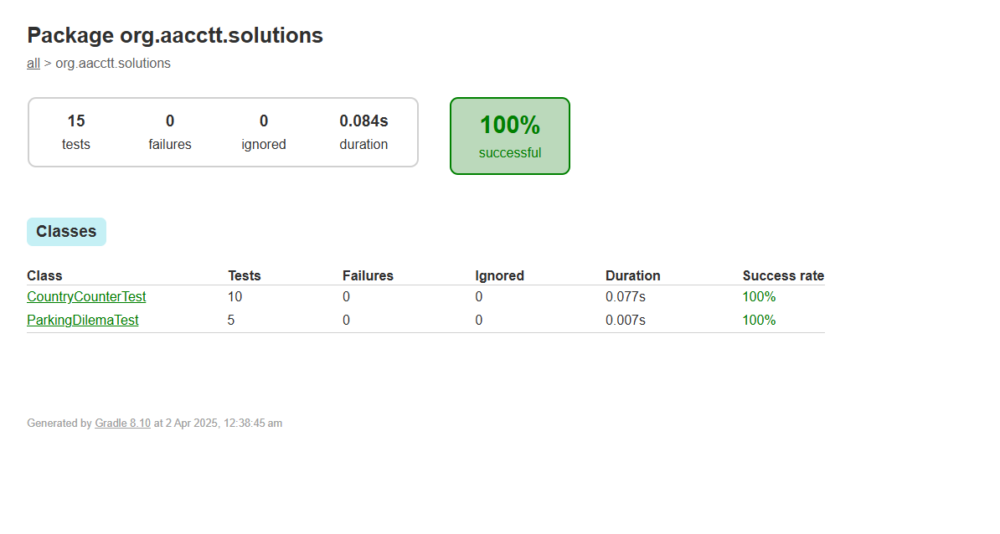

# Kotlin LeetCode Solutions
[](https://github.com/akshayjoyinfo/aacctt-algorithm-solutions/actions/workflows/build.yaml)

This repository AACCTT Algorithm problems implemented using Kotlin. Each solution is tested using Kotlin's standard test framework.

## 📌 Problems Solved:
1. **Country Counter** (CountryCounter.kt)
2. **Reverse Linked List** (Problem2.kt)
3. **Main.kt** (Mainly for performance concern tests)

## 🚀 How to Run:
1. Clone the repo:
   ```sh
    git clone https://github.com/akshayjoyinfo/aacctt-algorithm-solutions.git
    cd AlgoKotlin
    ./gradlew build
    ./gradlew test          #Verify test results in build/reports/tests/test/index.html
   ```

2. Verify the Test Results

<div style="display: flex; justify-content: space-between;">
    
    
</div>


## 🚀 Build & Tests:

Build and Tests are running once PR or merge to Main branc initiated , already enabled github actions with JAVA 23, Kotlin 2.0.21


#### 🚀 Memory Calculation Country Counter Problem:

Matrix Size

- **Total elements**: 30,000 * 10,000 = 300,000,000 elements.

Memory for Matrix

- **Each `Int`**: 4 bytes.
- **Total bytes**: 300,000,000 * 4 = 1,200,000,000 bytes.
- **Convert to gigabytes**: 1,200,000,000 / (1024^3) ≈ 1.12 GB.

Additional Memory

- **Visited array (Boolean)**: Requires 300,000,000 bytes.
- **Total additional memory**: ≈ 0.28 GB.

Total Estimated RAM

- **Total RAM Needed**: Approximately 1.4 GB.
